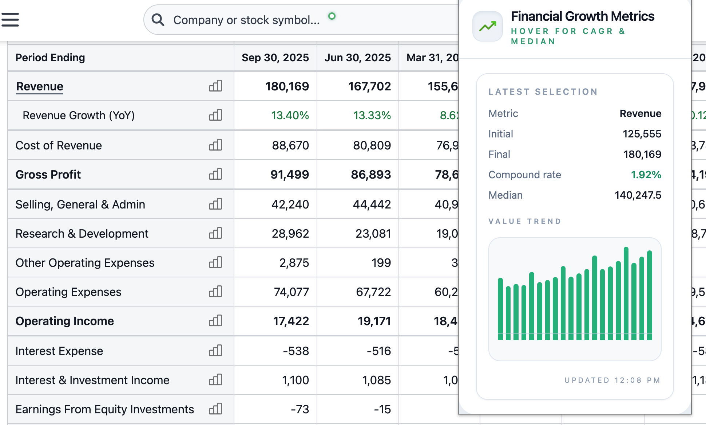

# Financial Growth Metrics Calculator (Chrome Extension)

> Hover any financial table to surface compound annual growth rate (CAGR) and median values instantly.

This Chrome extension lets analysts and investors move their cursor across rows in financial tables to reveal growth metrics without copy-pasting data into spreadsheets. The median value and CAGR for each row are calculated in-browser and presented in a polished popup, while the table cells involved are subtly highlighted.

<p align="center">
  
</p>

> ℹ️ **Repository:** [jawadshuaib/financial-growth-metrics-calculator-extension](https://github.com/jawadshuaib/financial-growth-metrics-calculator-extension)

## Key Features

- **Hover-driven analytics** – move the cursor over any tabular data to compute CAGR and median values automatically.
- **Popup dashboard** – see metric name, initial value, final value, CAGR, and median in a tidy React + Tailwind popup.
- **Column/row highlighting** – the exact cells used in the calculation are lightly emphasized for context.
- **Pointer indicator** – a minimalist cursor companion shows the extension is active without obscuring data.
- **Local-only processing** – all computations run in your browser; no data leaves the page. Temporary results are cached only in `chrome.storage.local` for the popup display.
- **Open source** – built with React, TypeScript, Tailwind, and Vite.

## Installation (Local Development)

1. **Clone the repository**
   ```bash
   git clone https://github.com/jawadshuaib/financial-growth-metrics-calculator-extension.git
   cd financial-growth-metrics-calculator-extension
   ```

2. **Install dependencies**
   ```bash
   npm install
   ```

3. **Run the dev server (optional)**
   ```bash
   npm run dev
   ```
   - Opens a Vite dev server for live popup development (`http://localhost:5173`).
   - Use Chrome's “Load unpacked” feature (see below) pointing at `dist/` after running a build.

4. **Build the extension**
   ```bash
   npm run build
   ```
   - Outputs bundled assets to `dist/`.

5. **Load into Chrome**
   - Open `chrome://extensions`.
   - Enable **Developer mode**.
   - Click **Load unpacked** and select the `dist/` folder.

## Project Structure

```
├─ public/
│  ├─ icon.png          # Extension icon
│  └─ manifest.json     # Chrome extension manifest (MV3)
├─ src/
│  ├─ content/          # Content script logic (TypeScript)
│  └─ popup/            # React popup (components, styles)
├─ dist/                # Build output (generated)
├─ PRIVACY.md           # Privacy policy
├─ README.md            # This file
├─ package.json         # Scripts & dependencies
└─ vite.config.ts       # Vite bundler configuration
```

## Tech Stack

- **Framework:** React 19 + TypeScript 5
- **Styling:** Tailwind CSS 3
- **Bundler:** Vite 7
- **Chrome APIs:** `scripting`, `activeTab`, `storage`
- **Testing:** Manual (load unpacked + in-browser behaviour). Feel free to add automated tests if contributing.

## Privacy

- No personal data is collected or transmitted.
- Calculations (median, CAGR) run entirely in the browser.
- Temporary hover summaries are cached locally in `chrome.storage.local` for popup display.
- Review the full [Privacy Policy](./PRIVACY.md).

## Publishing Checklist

1. Run `npm run build` and ZIP the contents of `dist/` (manifest must be in the root of the ZIP).
2. Prepare high-quality screenshots and confirm `icon.png` meets Chrome Web Store requirements.
3. Provide the privacy policy link (e.g., `https://github.com/jawadshuaib/financial-growth-metrics-calculator-extension/blob/main/PRIVACY.md`).
4. Fill out the Chrome Web Store listing, upload the ZIP, and submit for review.

## Contributing

Contributions, bug reports, and feature requests are welcome! Please:

1. Fork the repo and create your branch from `main`.
2. Keep PRs focused and add context in the description.
3. Run `npm run build` before submitting to ensure the extension bundles cleanly.

## License

MIT License © [Jawad Shuaib](mailto:jawad.php@gmail.com)
